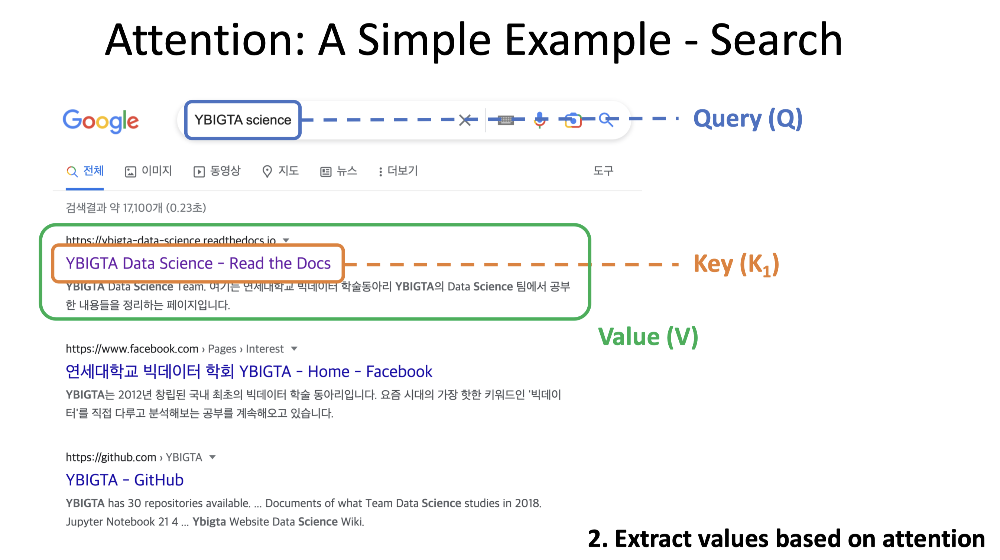
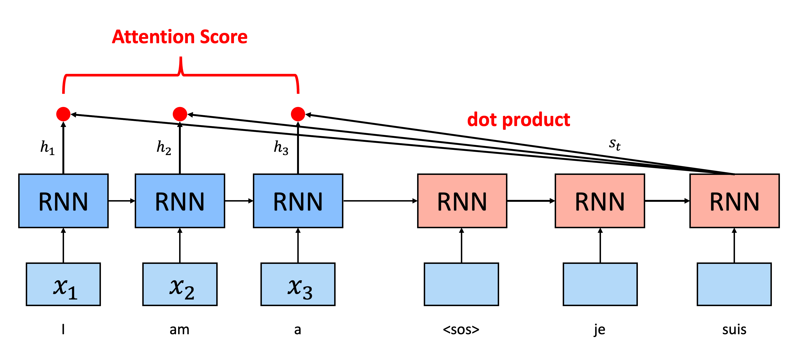
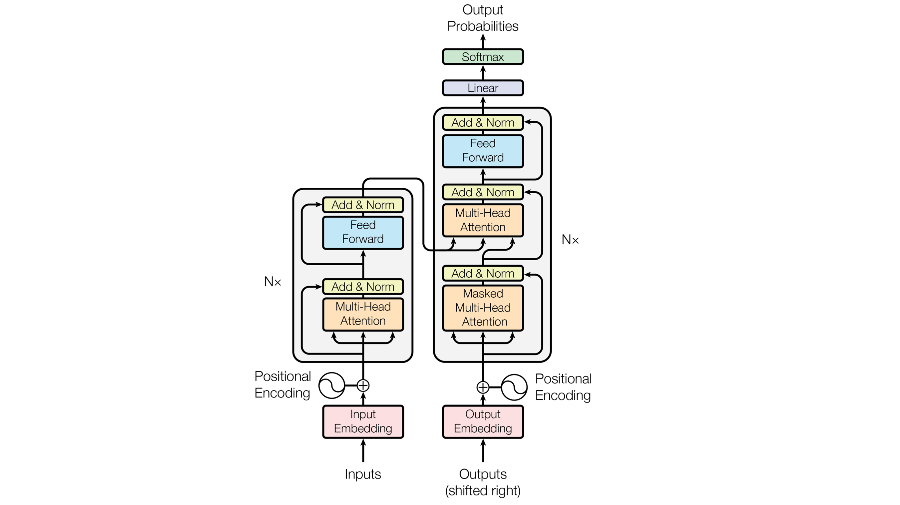

# 02. Attention and Transformer

## Seq2seq model

<figure><figcaption>
seq2seq  model
</figcaption></figure>

NLP에서 중요한 task들 중 하나인 machine translation에서 기존에는 seq2seq 모델을 주로 활용해 왔습니다. 이는 RNN 기반의 인코더 네트워크와 디코더 네트워크를 결합한 구조로, 인코더 네트워크에서 입력 문장을 받아서 context vector의 형태로 압축한 후, 이를 디코더 네트워크에 집어넣어서 출력 문장을 생성하는 형태입니다. 앞서 배운 RNN을 활용한 machine translation model 중 가장 단순한 형태라고 생각할 수 있습니다. Input은 character level로 집어넣을 수도 있지만, 높은 성능을 위해서는 word2vec 등 다양한 임베딩 방법들을 활용하여 word level로 집어넣는 것도 가능합니다.

## 기존 seq2seq model의 한계

앞서 배운 seq2seq model에는 2가지 큰 문제가 존재합니다.

1. RNN을 이용한 구조는 sequential하므로 GPU의 massively parallel한 아키텍쳐를 잘 활용하기가 어렵습니다. 한 문장을 처리할 때 한 번에 집어넣기보다는 word by word로 처리하므로 느립니다.
2. Long term dependency issue가 존재합니다. Recurrent model에 존재하는 vanishing / exploding gradient 문제로 인해 오래 전 input들을 모델이 잊어버리는 문제가 나타납니다. LSTM / GRU에서 이를 어느정도 해결하였지만, 여전히 한계가 있습니다. 인코더 - 디코더 구조에서 하나의 벡터로 정보를 압축하는 과정에서도 유사한 정보 손실이 나타납니다.

이러한 문제들로 인해 입력 문장이 길어질 경우에 seq2seq 모델은 효과적으로 동작하지 않게 됩니다.

## Attention

Attention 기법에서는 output word 예측 시점마다 input sequence를 다시 참고하는 아이디어를 사용합니다. 이때 현재 예측을 해야 하는 단어와 관련된 단어에 더 집중해서 참고하겠다는 것입니다. Attention 메커니즘을 이해하려면 핵심 개념인 query, key, value를 이해해야 합니다.

1. Query(Q), Key(K), Value(V) 개념

이를 위해서 각 time step에서 디코더가 예측을 해야 하는 단어와 관련된 단어에 더 높은 가중치를 부여하게 됩니다. 그렇다면 어떻게 이 가중치를 계산할지가 핵심이 됩니다. 여기에서 Query (Q), Key (K), Value (V)의 개념이 등장합니다. Q, K, V는 검색에 비유해서 보면 쉽게 이해할 수 있습니다.

<figure><figcaption>
Attention
</figcaption></figure>

우리가 현재 관심있는 대상인 Q가 있다고 해봅시다. Q를 가지고 검색을 하면 다양한 K들이 문서마다 나타납니다. 여기에서 K는 문서의 제목이 됩니다. 그런데 검색 결과는 여러 개이므로 여러 개의 K가 존재하며, 우리는 검색 대상인 Q와 가장 일치하는 K를 찾기를 원합니다. 따라서 Q와 K 사이의 유사도를 계산하게 되고, 이를 attention mask를 구한다고 말합니다.

Attention mask를 계산하고 나면 해당 유사도에 따라서 실제 V, 여기서는 문서의 내용을 가져오면 됩니다. 즉, query와 key 사이의 유사도를 바탕으로 attention mask를 구한 뒤 이를 바탕으로 최종 prediction을 하는 형태로 이해할 수 있습니다.

2. 실제 예제

다양한 종류의 attention이 존재하고 적용될 수 있는 예제도 많지만, 여기에서는 가장 단순한 형태로 seq2seq 구조에 dot product attention을 적용한 예제를 살펴보겠습니다.

<figure><figcaption>
Dot product attention
</figcaption></figure>

출력 단어를 예측할 때 입력 단어들의 정보를 참고하면 됩니다. 이를 위해서 인코더 RNN의 각 hidden state들이 현재 디코더 부분의 hidden state와 얼마나 유사한지를 봐주면 됩니다.

인코더 LSTM layer에 존재하는 각각의 hidden state들을 $$h_1, h_2, h_3, h_4$$로 표현하였습니다. 디코더 LSTM layer의 현재 hidden state를 $$s_t$$라고 하면 두 벡터의 dot product를 통해 유사도를 계산할 수 있습니다. 그림에서는 인코더의 hidden state가 4개이므로 총 4개의 attention score가 나옵니다. 4개의 attention score를 softmax 함수에 통과시키면 attention distribution을 구할 수 있고, 이를 hidden state인 $$h_1, h_2, h_3, h_4$$와 가중합을 하면 최종 attention value를 구할 수 있게 됩니다. 이렇게 구한 attention value를 context vector라고 합니다. 정리하자면 아래와 같습니다.

K (Key): Encoder LSTM의 hidden state인 $$h_1, h_2, h_3, h_4$$

Q (Query): Decoder LSTM의 현재 시점에서의 hidden state인 $$s_t$$

V (Value): Encoder LSTM의 hidden state인 $$h_1, h_2, h_3, h_4$$

이렇게 구한 context vector인 $$a_t$$를 디코더의 $$s_t$$와 concatenate하여 최종 output prediction에 활용하게 됩니다.

## Transformer

Transformer 모델은 ‘attention is all you need’ paper에서 처음으로 등장하였으며, 다양한 machine translation task에서 SOTA를 달성하며 최근까지 널리 사용되는 아키텍쳐입니다. 추후에 등장하는 BERT나 GPT 등 유명한 모델들도 모두 transformer 모델에 기반하여 만들어졌으며, 최근에는 컴퓨터 비전에서 classification, detection 등 분야를 확장해나가고 있는 추세입니다.

트랜스포머 모델 역시 seq2seq 모델과 마찬가지로 인코더 디코더 구조를 따르고 있습니다. 우선 인코더에 입력 문장이 들어가야 하는데, 트랜스포머는 recurrent model들과는 달리 입력 단어를 병렬적으로 한 번에 처리합니다. 따라서 GPU나 TPU를 사용한 병렬 연산에 매우 적합하다는 장점이 있습니다. 그러나 이 방법은 입력 단어들 사이의 순서가 완전히 무시된다는 문제가 있습니다. 이를 해결하기 위해서 positional encoding이라는 중요한 방법이 사용됩니다.

<figure><figcaption>
Positional encoding
</figcaption></figure>

단어를 인코더 블록에 집어넣기 전에 embedding vector로 변환하게 됩니다. 이때 단어의 위치를 나타낼 수 있는 추가적인 정보를 더해줌으로써 입력 단어의 순서 관계를 모델이 고려하도록 할 수 있습니다.

이때 더해주는 position vector가 만족시켜야 하는 다양한 조건이 있으나, 여기에서는 sine / cosine 함수를 활용하는 것이 이 조건에 부합한다고 간단하게 이해하면 됩니다. 따라서 sine, cosine 함수를 이용하여 positional encoding을 해주고, 이 벡터를 embedding vector와 더해서 단어의 위치 정보를 반영해주면 됩니다. 이때 paper에서 제시한 방법은 두 벡터를 elementwise하게 더하게 되는데 사실 concatenation을 사용하는 방법도 가능합니다.

<figure><figcaption>
Transformer
</figcaption></figure>

Transformer 모델의 전체적인 구조입니다. 여기에서 왼쪽이 인코더, 오른쪽이 디코더입니다.

인코더 부분은 동일한 layer를 N개 쌓아서 구성됩니다. 그림에는 하나의 layer만 나타나 있고, 각 layer는 multi-head self attention layer와 pointwise FFNN layer로 구성됩니다.

디코더 부분도 동일한 layer를 N개 쌓아서 구성되며, 여기에서는 인코더의 layer 구조에 multi-head attention layer가 하나 추가된 것을 볼 수 있습니다.

인코더와 디코더의 multi-head self attention layer에는 ‘self’라는 말이 들어갑니다. 이는 attention을 구할 때 Q, K, V를 모두 동일하게 사용하겠다는 것입니다. 입력 문장에는 단어에 positional encoding이 추가된 벡터들이 존재할 것입니다. 이 단어 벡터들을 이용하여 먼저 Q, K, V를 얻어야 합니다. 이때 동일한 단어 벡터에 weight matrix를 곱하는 형태로 Q, K, V를 얻게 됩니다.

Q, K, V를 얻고 나면 앞서 언급한 attention mechanism과 거의 동일한 방법으로 attention distribution을 구한 뒤 이를 V 벡터들과 가중합하여 최종 context vector를 구할 수 있습니다. 물론 각각의 단어들에 대해서 개별적으로 수행하는 것이 아니고, 행렬 곱셈의 형태로 수행됩니다. 이는 GPU에서 행렬 곱셈을 매우 빠르게 수행할 수 있도록 이미 CUDA로 구현된 라이브러리가 존재하기 때문입니다. 또한 여러 번의 attention을 병렬적으로 활용하는 multi-head attention 기법을 사용하여 input words 사이의 다양한 관계를 더 잘 포착하도록 하였습니다.

디코더 부분의 두 번째 layer는 query가 decoder matrix이고, key와 value가 encoder matrix이므로 self attention은 아닙니다. 여기에서는 encoder의 마지막 layer에서 나온 matrix를 key와 value로 사용하고 decode의 첫 번째 sub-layer에서 나온 matrix를 query로 사용하여 attention score를 계산하게 됩니다.

이렇게 구현한 인코더와 디코더를 N개씩 쌓아서 최종적으로 transformer를 만들 수 있습니다.

