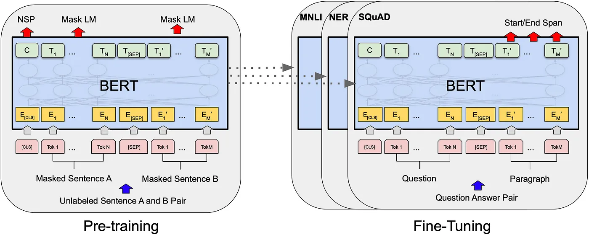
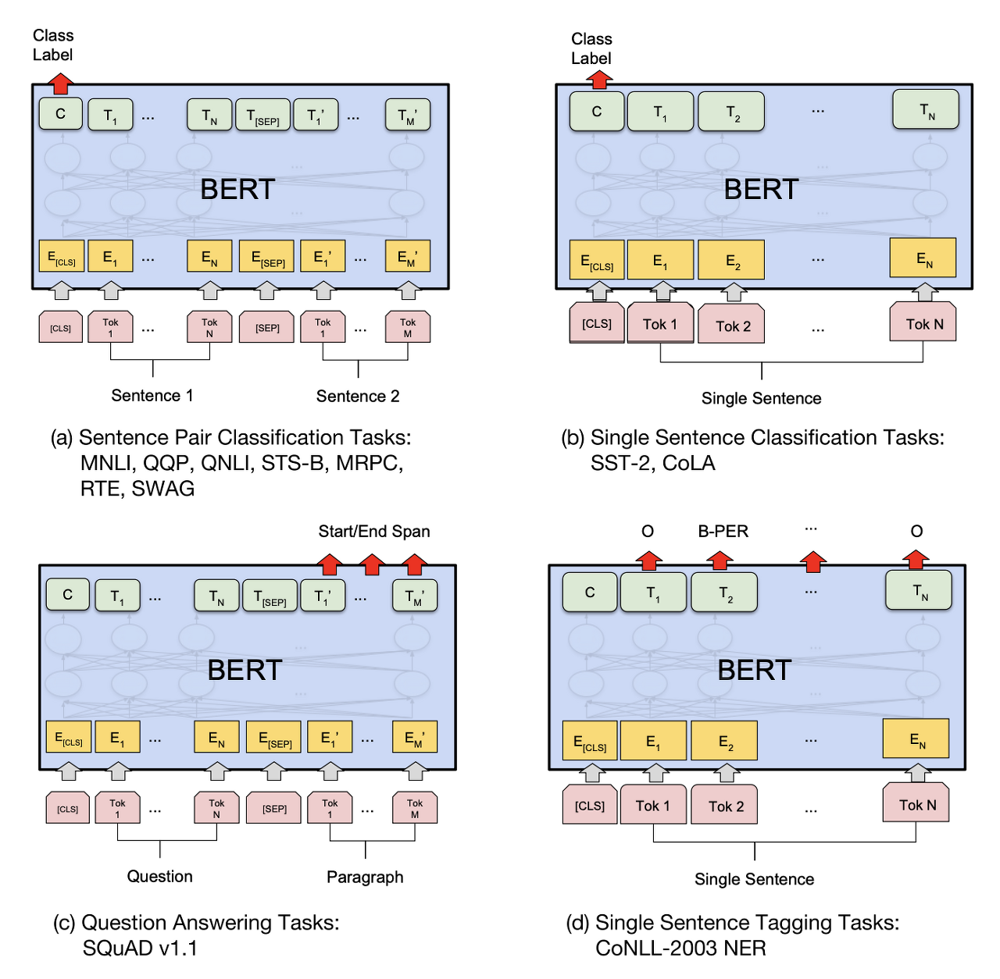

# 03. ELMo, BERT

## ELMO

ELMo는 주변 문맥을 고려하여 단어 임베딩을 하는 방법입니다. 기존의 word2vec이나 GloVe는 주변 문맥을 고려하지 않고 같은 단어라면 같은 벡터로 임베딩을 해줍니다.

예를 들어 아래의 두 문장에서 ‘배’라는 단어는 완전히 다른 의미를 가지지만, 앞선 임베딩 방식으로는 같은 임베딩 벡터가 된다는 문제가 있습니다.

1. 혁준이는 **배**를 타고 떠났다
2. 혁준이는 **배**를 맛있게 먹었다

그러나 단어를 임베딩할 때 해당 단어 주변의 문맥을 고려하여 임베딩을 해준다면 모델의 성능이 더 높아질 것입니다. 이때 ELMO에서는 사전 학습된 언어 모델을 이용하여 단어 임베딩을 합니다. 이렇게 문맥을 반영한 임베딩 방식을 contextualized word embedding이라고 합니다.

ELMo를 이해하기 위해서는 우선 bidirectional language model (biLM)에 대한 이해가 필요합니다.

biLM model는 2개의 layer를 포함하고 있는데, 각각의 layer는 forward pass와 backward pass를 모두 가집니다. 우선 character-level CNN을 이용하여 단어를 word vector로 바꿔줍니다. 그리고 해당 word vector들을 biLM의 첫 번째 layer의 input으로 집어넣게 됩니다. Forward pass에서는 특정 단어와 해당 단어 ‘이전’의 단어들 사이의 문맥을 얻게 되며, backward pass는 해당 단어 ‘이후’의 단어들 사이의 문맥을 얻게 됩니다. 이를 통해서 intermediate word vector들을 얻게 되며, 이를 다음 layer에 집어넣게 됩니다.

여기에서 ELMo의 final representation은 2개의 intermediate word vector들과 raw word vector들을 가중합하여 얻게 됩니다. 복잡한 과정처럼 보이지만 여기서 핵심은 임베딩된 벡터가 결국 입력 sequence 전체의 영향을 받아서 만들어진다는 것입니다.'

## ELMo의 장점

ELMo를 통해서 word embedding을 하게 되면 결과로 나오는 벡터가 해당 단어가 포함된 문장 전체의 의미를 담게 됩니다. 따라서 동일한 단어가 문맥에 따라 다양한 의미를 갖는다는 점을 반영하게 되는 것입니다. 예를 들면 단어의 시제, 복수형 등 다양한 변형들을 잘 포착하기 때문에 NLP의 다양한 task에서 더 높은 성능을 낼 수 있게 됩니다. 아래는 논문에서 제시한 3가지 장점을 요약한 것입니다.

1. ELMo는 단어 주변의 문맥을 고려하여 임베딩을 합니다.
2. ELMo는 방대한 text corpus를 이용하여 사전 학습시켜 사용할 수 있습니다.
3. ELMo는 오픈소스이며 다양한 NLP task에 쉽게 적용할 수 있습니다.

이러한 장점들 덕분에 ELMo는 question answering, sentiment analysis 등 NLP task에서 SOTA를 달성하였으며, 무엇보다 다음에 설명할 BERT와 아주 큰 관련이 있습니다.

## BERT

BERT (Bidirectional Encoder Representations from Transformers)는 2018년에 공개되어서 NLP의 많은 task들에서 SOTA를 달성한 모델입니다. 특히 human-level performance를 능가하는 성능도 보이며 이목을 끌었습니다.

<figure><figcaption>
BERT
</figcaption></figure>

BERT는 ELMo와 마찬가지로 단어 주변의 문맥을 고려한 임베딩 방식을 활용하였으며, 대규모 데이터로 사전학습되어서 높은 성능을 낼 수 있습니다. 또한 text sequence를 양방향으로 활용하여 training했다는 큰 특징이 있습니다.

## BERT의 동작 방식

기존의 transformer 구조에서는 입력 텍스트를 인코딩하는 인코더와 각 task마다 정해지는 output을 출력해주는 디코더로 구성됩니다. BERT에서는 인코더 부분만을 활용하게 됩니다. 또한 앞서 배운 directional model들과 달리 BERT는 input text를 한 번에 읽어들이게 됩니다. 이는 transformer에서 encoder 부분을 사용하기 때문입니다. 또한 BERT는 language representation model이므로 인코더 부분만을 필요로 한다고 생각하면 됩니다.

BERT를 training할 때의 핵심적인 아이디어는 language model이 특정 문장의 빈칸을 예측하도록 하는 것입니다. 특정 sequence에서 단순히 다음 단어를 예측하도록 하기보다는 Masked LM (MLM)이라는 방법을 활용하여 랜덤하게 문장의 단어들을 마스킹하고, 이를 예측하도록 합니다. 이때 모델이 빈칸 주변 (왼쪽, 오른쪽 모두)의 단어들을 모두 고려하여 빈칸을 채운다는 것이 중요합니다. Bidirectional이라는 말을 사용하지만 실제로는 방향이 아예 존재하지 않는 모델에 가깝습니다. 또한 BERT에서는 transformer의 인코더 부분을 활용하는데, 여기에서는 attention mechanism을 활용하여 입력 문장의 모든 단어들 사이의 관계를 인식할 수 있게 됩니다.

## BERT의 임베딩 방법

1.  Token embedding

    Token embedding layer는 입력 단어를 vector representation으로 바꿔주는 역할을 합니다. BERT에서는 768차원의 벡터로 바꾸게 됩니다. 구체적으로는 먼저 input text를 wordpiece tokenizer를 이용하여 최소 단위까지 계속해서 쪼개주면서 vocabulary에 존재하는 토큰인지를 확인하게 됩니다. 이때 문장의 시작 부분에 \[CLS] 토큰이 들어가고, 쪼개진 문장 사이에는 \[SEP] 토큰이 들어가게 됩니다. 그리고 나면 이를 token embedding 방법을 이용하여 768차원의 vector representation으로 바꿔주는 것입니다.
2.  Segment embedding

    두 개의 문장을 집어넣는다면 둘 중 어느 문장에 속하는 토큰인지를 알려주는 marker의 역할을 합니다. 만약 문장이 한개라면 모든 위치를 0으로 임베딩해주면 됩니다.
3.  Position embedding

    Transformer에서 사용하는 positional encoding과 유사하면서도 약간은 다른 방법입니다. Paper에서는 이를 자세하게 설명하고 있지는 않으나 position embedding은 trainable parameter를 사용한다는 점이 중요합니다.

이렇게 3가지 임베딩을 해준 뒤 element-wise하게 더해서 single representation을 만들어내게 되고, 이것이 BERT의 encoder로 들어가는 벡터가 됩니다.

## &#x20;BERT의 training 방식

그동안 statistical language model에서는 모델이 다음 단어를 예측하도록 하는 방식으로 training이 되었습니다. 그러나 BERT는 bidirectional하게 training되어야 하기 때문에 이러한 방법을 활용할 수가 없습니다. 따라서 masked language model과 next sentence prediction이라는 주요한 아이디어가 활용됩니다.

1.  Masked LM (MLM)

    BERT를 training할 때에는 input 단어들 중에서 15%를 랜덤하게 masking하여 \[MASK] 토큰으로 대체한 후 인코더에 집어넣어 주고, masking된 부분을 예측하는 방식으로 training이 됩니다. 다만 이러한 방식으로 하면 \[MASK] token이 현재 input에 존재할 때에만 모델이 예측을 하게 된다는 문제가 있습니다. 예를 들어 fine-tuning을 진행할 때에는 해당 토큰이 존재하지 않으므로 문제가 될 수 있습니다. 따라서 실제로는 80%를 \[MASK] 토큰으로 대체하고 10%를 랜덤한 토큰으로 대체하는 방식을 활용합니다.
2.  Next Sentence Prediction (NSP)

    모델이 두 문장 사이의 관계를 이해하도록 하기 위한 training 기법입니다. Training 과정에서 BERT는 한 쌍의 input 문장을 받고 두 번째 문장이 첫 번째 문장에 이어지는 문장인지를 판별합니다. 또한 한 쌍의 문장 사이에는 \[SEP] 토큰이 삽입되어서 input으로 주어지게 됩니다. 구체적으로는 input sequence를 집어넣은 다음 \[CLS] 토큰의 output을 2 x 1의 벡터 형태로 변형한 뒤 softmax 함수를 적용하게 됩니다.

두 방법을 따로 설명하였지만 실제로 training이 될 때에는 동시에 두 방법이 적용됩니다. 이를 위해서는 단순히 2가지를 모두 고려해서 loss를 설계해주기만 하면 됩니다.

## Application of BERT

<figure><figcaption>
BERT application
</figcaption></figure>

BERT는 다양한 NLP task에서 높은 성능을 보일 수 있습니다. 특히 large corpus를 이용하여 사전 학습되었기 때문에 task-specific하게 fine-tuning만 해주면 비교적 적은 양의 데이터로도 좋은 결과를 얻을 수 있습니다. 대표적으로 sentiment analysis, fake news detection 등의 분야에 적용될 수 있습니다.

다만 BERT는 다음 단어를 예측하는 방식이 아닌 중간에 masking된 단어를 예측하는 방식으로 training되었기 때문에, text generation에는 적합하지 않다는 단점이 있습니다. 다음에는 이와 관련해서 높은 성능을 보이는 모델인 GPT를 다뤄봅시다.
