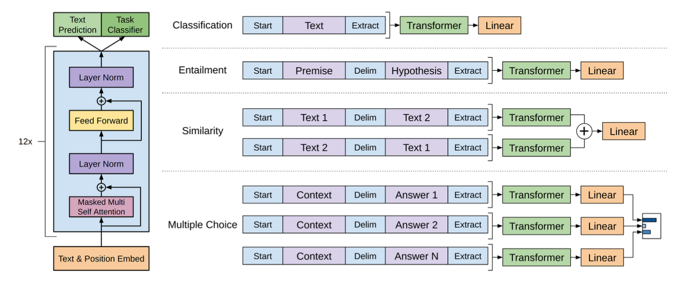

# 04. GPT

## Introduction

기존의 NLP 모델들은 labeling이 되어있는 데이터셋을 활용하여 supervised 방식으로 학습을 진행하는 경우가 많았습니다. 예를 들어 text summarization, question answering 등의 task에 대해서 방대한 양의 labeled dataset을 구축한 뒤 이를 이용하여 모델을 만드는 방식입니다. 그러나 대부분의 텍스트 데이터는 label이 존재하지 않는 형태로 존재하므로 supervised 방식만으로는 방대한 양의 데이터를 활용하기가 어렵습니다. 또한 특정 task에 대해서 supervised 방식으로 training된 모델은 task가 살짝만 달라져도 generalize가 되기 힘들다는 문제가 있습니다. 이러한 문제를 GPT 모델에서는 어떻게 해결했는지 알아봅시다.

## GPT-1: Improving Language Understanding by Generative Pre-Training

GPT-1의 paper에서는 NLP 모델이 supervised learning에 의존하는 것을 줄이고 방대한 양의 raw text data로부터 효과적으로 학습할 방법이 필요하다고 언급하고 있습니다. 다만 unlabeled text로부터 학습을 하려면 두 가지의 challenge가 존재합니다.

먼저 label이 없으므로 optimization을 위한 objective를 정하기 어렵다는 문제가 존재합니다. 예를 들면 machine translation, question answering, language modeling 각각의 task에서 labeled data를 활용한다면 어떠한 objective를 사용해야 할지가 명확하지만, unlabeled data의 경우에는 이를 정하기 어렵습니다.

다음으로 학습된 representation을 target task에 전달하기 위한 명확한 합의가 존재하지 않는다는 문제가 존재합니다. 예를 들어 model의 architecture를 task-specific하게 변화시킬 수도 있지만, 어떤 architecture가 효과적인지에 대해서는 명확한 consensus가 존재하지 않습니다.

이러한 문제점들을 해결하고 효과적인 semi-supervised learning 방법을 만들기 위해서 이 paper에서는 두 가지 단계를 거칩니다.

1. Unsupervised pre-training
2. Supervised fine-tuning

1. Unsupervised pre-training

$$
L_1(T) = \sum_i logP(t_i | t_{i - k}, ..., t_{i - 1}; \theta)
$$

Unsupervised pre-training 과정에서는 일반적인 language model objective가 사용됩니다. $$i - 1$$번째 토큰부터 $$i - k$$번째 토큰까지 총 $$k$$개의 토큰을 이용해서 $$i$$번째 토큰을 예측할 likelihood를 최대화하는 방향으로 model parameter $$\theta$$를 업데이트하는 것입니다. 학습 과정에서 text의 label이 필요하지 않다는 점이 특징입니다.

2. Supervised fine-tuning

$$
L_2(C) = \sum_{x, y} logP(y | x_1, ..., x_n)
$$

Pre-training이 끝난 뒤 target task에 따라서 parameter를 조정하는 과정입니다. 앞서 얻은 pretrained model에 input token들을 통과시킨 후, 마지막에 linear layer를 두고 softmax 함수를 통과시키면 확률분포를 구할 수가 있습니다. 이를 활용하여 supervised learning을 해주면 됩니다.

$$C$$는 training example에서 labeled dataset을 의미합니다. 여기에서는 input 토큰 $$x_1, ..., x_n$$을 넣었을 때 label $$y$$를 반환할 likelihood를 최대화하게 됩니다.

실제로는 supervised learning 과정에서도 pre-training시의 objective function인 $$L_1$$을 auxiliary objective로 추가하여 일반화 성능을 향상시키게 됩니다.

<figure><figcaption>
Task-specific input transformations
</figcaption></figure>

GPT를 training하고 나면 구조를 약간씩만 바꾸고 target task에 맞게 fine-tuning을 해줌으로써 높은 성능을 기대할 수 있습니다. 이를 통해서 GPT는 labeled data에 덜 의존하면서도 다양한 NLP task를 해결할 수 있는 강력한 언어 모델이 됩니다. 구체적으로 당시 NLP에서 벤치마킹에 사용되던 12개의 task들 중 9개에서 supervised 방식으로 학습된 SOTA model을 능가하는 성능을 보였습니다.

## GPT-2: Language Models are unsupervised multitask learners

GPT-1에서는 transformer 아키텍쳐와 unsupervised learning을 활용하여 높은 성능을 낼 수 있었습니다. 그러나 여전히 task-specific하게 supervised learning을 하는 과정이 포함되어 있다는 한계가 존재합니다. GPT-2에서는 supervised fine-tuning 방식을 사용하지 않고도 task마다 높은 성능을 낼 수 있다는 중요한 차이점이 있습니다. 기존의 방법과 달리 pre-trained model 하나만을 이용해서도 zero-shot 방식으로 downstream task를 해결할 수 있는 general한 모델을 만들겠다는 것입니다. Paper에서는 아래의 2가지 중요한 방법을 언급합니다.

1.  Task conditioning

    특정 task를 해결하기 위한 language model을 만드는 것은 $$p(output | input)$$의 조건부 확률을 estimate하는 과정으로 볼 수 있습니다 그러나 다양한 task에 모두 generalize되는 모델을 만들기 위해서는 input뿐만 아니라 task도 고려해야 합니다. 즉, $$p(output | task, input)$$을 estimate해야 하는 것입니다. 이를 task conditioning이라고 하며, 모델이 동일한 input에 대해서도 task에 따라서 다른 output을 낼 수 있다는 것을 의미합니다.
2.  Zero shot learning and zero shot task transfer

    Zero shot learning이란 모델에 추가적인 예시를 제공해주지 않아도 주어진 instruction을 기반으로 모델이 task를 이해하도록 하는 것을 말합니다. GPT-2에서는 input을 적절한 형태로 바꿔서 모델이 task를 이해할 수 있도록 하였습니다. 예를 들어 영어를 프랑스어로 번역하는 task의 경우에는 영어 문장과 프랑스어 문장 사이에 프롬프트 (:)를 추가하는 방식입니다.

GPT-1에서는 book corpus data를 이용하여 모델을 pre-train 하였습니다. GPT-2에서는 높은 퀄리티의 데이터를 확보하기 위해서 Reddit에서 좋은 평가를 받은 글들을 스크랩핑하여 사용하였습니다. 또한 데이터 사이의 중복을 제거하기 위해서 위키피디아 글을 제거하였습니다.

Input representation으로는 Byte Pair Encoding (BPE)라는 방법을 사용하였는데, 문자 단위로 단어를 계속 분해하면서 등장하는 빈도수가 높은 문자 pair를 vocabulary에 추가하는 방법입니다.

결과적으로 GPT-2는 zero-shot 환경에서 8개의 데이터셋 중 7개에서 SOTA를 달성하였으며, 크기가 더 작은 데이터셋에 대해서는 더 큰 margin으로 기존의 SOTA 모델을 능가하였습니다. GPT-2는 기존의 language model과 달리 fine-tuning 없이도 높은 성능을 보인다는 큰 장점이 있습니다.

## GPT-3: **Language models are few shot learners**

GPT-2와 유사한 아키텍쳐이지만 self-attention layer를 늘려서 parameter 수가 GPT-2보다 100배정도 많고, sparse attention을 활용했다는 차이가 존재합니다. 또한 훨씬 방대한 데이터를 이용하여 training을 진행하였습니다. 해당 논문에서는 in-context learning의 환경을 one-shot, zero-shot, few-shot 환경으로 구분하였으며 각각에 대해서 성능을 측정하였습니다. 성능을 측정하는 동안 gradient update나 fine-tuning은 진행하지 않았고, 프롬프트에 존재하는 예시의 개수에 따라서 모델의 성능이 어떻게 달라지는지를 측정한 것입니다.

1. Few-shot: 모델이 inference를 할 때에 몇 개의 예시를 허용해주는 방법입니다. 예를 들어 영어를 프랑스어로 번역하는 예시를 2개정도 제공해 주고, 마지막 예시에 대해서 번역을 하는 방식입니다.
2. One-shot: Few-shot에서 단 1개의 예시만을 허용해주는 방법입니다.
3. Zero-shot: 예시를 하나도 제공해주지 않고 task에 대한 instruction만을 주는 방법입니다. 사람이 작업을 수행하는 것과 가장 유사한 상황이지만 당연히 가장 어렵습니다.

Training을 위한 데이터로는 Common Crawl, WebText2, Books1, Books2, 위키피디아를 활용하였으며 각각 다른 가중치를 주었습니다.

결과적으로 machine translation, question answering 등 다양한 task에서 높은 성능을 보였으며 상대적으로 어려운 task에 대해서도 몇 개의 예시만 보고도 적절한 답을 내놓는 것을 볼 수 있었습니다. 예를 들면 사람이 쓴 것과 구분하기 힘들 정도로 정교한 article을 작성하거나, SQL query를 작성하는 task를 잘 수행해냈습니다.

Paper에서는 GPT-3 model의 약점에 대해서도 언급하고 있습니다. 대표적으로 아주 긴 text generation에서는 동일한 내용을 반복하는 등 일관성을 잃는 문제를 보였고, 문장 사이의 관계 결정이나 빈칸 채우기 등 NLI task에서는 높은 성능을 보이지 못하였습니다. 이는 GPT-3 model이 bidirectional하지 않고 방향성이 존재하기 때문이라고 추측할 수 있습니다. 또한 parameter의 수가 매우 많아서 training시 드는 비용이 크고, 방대한 corpus로 학습되었으므로 모델이 gender, race, religion bias를 가질 수 있다는 문제가 있습니다. 추후에 이러한 문제들을 해결하기 위해서 강화학습을 도입하게 됩니다.
