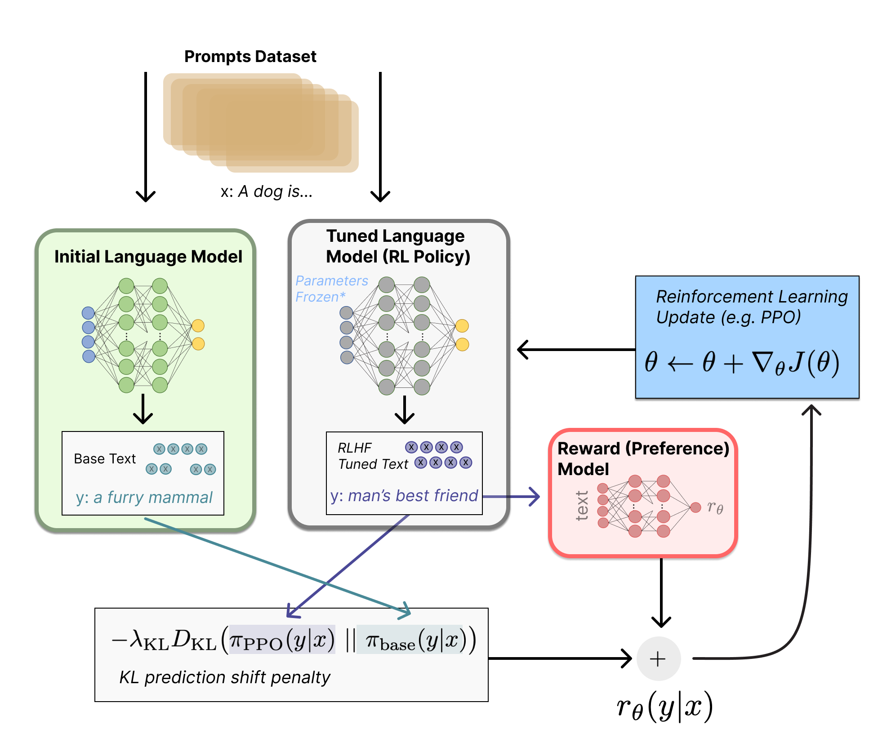
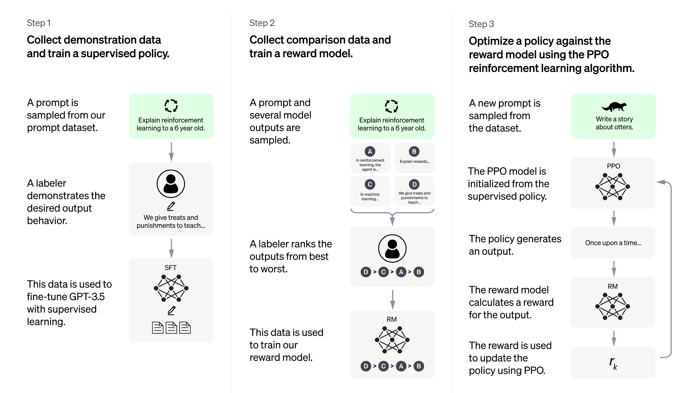

# 05. GPT-3.5 (InstructGPT), ChatGPT

## Introduction

GPT-3와 ChatGPT는 등장하자마자 많은 관심을 받았습니다. 그러나 이에 중요한 역할을 했음에도 주목받지 못한 모델이 있습니다. 바로 InstructGPT입니다. GPT-3.5라고 하면 실제로는 code-davinci-002, text-davinci-002, text-davinci-003 모델을 포함하며 text-davinci-002 모델이 InstructGPT라는 이름으로 알려져 있습니다. 대부분의 문서에서 InstructGPT와 GPT-3.5를 동일한 모델처럼 서술하고 있기에 본 페이지에서도 편의상 구분 없이 사용하겠습니다.

## InstructGPT: Reinforcement Learning with Human Feedback

> GPT-3 모델은 사람이 원하는 대답을 내놓지 못하며, 때로는 유해한 텍스트를 생성한다는 문제가 있었습니다.

GPT-3는 엄청난 양의 학습 데이터와 수많은 parameter를 통해 다양한 task에서 높은 성능을 보이며 주목을 받았습니다. 그러나 챗봇 형태로 사용하기에는 다소 무거운 모델이었으며 입력 크기의 제한이 있었습니다. 또한 GPT-3는 방대한 양의 텍스트 데이터로 학습되었으므로 때때로 유해한 내용을 생성하거나, 성별 / 종교 / 인종 등 편향성을 드러내는 표현을 한다는 문제가 있었습니다. 이러한 문제를 해결하고 더 사용자의 의도나 사회적 가치에 적합한 모델을 만들기 위해서 Reinforcement Learning with Human Feedback (RLHF)라는 방법이 도입됩니다. 모델이 생성한 텍스트에 대한 사람의 피드백을 사용하여 모델을 최적화하는 방법입니다. 그리고 이 때 강화학습이 사용됩니다. 구체적으로는 아래의 3단계를 따르게 됩니다.

1. Language model의 pretraining
2. Data를 모은 뒤 reward model을 training
3. 강화학습 방법으로 language model을 fine-tuning

<figure><figcaption>
Lambert, et al., "Illustrating Reinforcement Learning from Human Feedback (RLHF)", Hugging Face Blog, 2022.
</figcaption></figure>

1.  Pretraining language models

    이 단계에서는 그동안 살펴보았던 GPT-3 model의 pretraining 방법으로 baseline model을 하나 만들어주면 됩니다. OpenAI에서는 instructGPT를 위해서 GPT-3보다 약간 작은 버전의 모델을 pretraining하였습니다.
2.  Reward model training

    Text의 sequence를 받아서 이에 대한 ‘사람의 선호도’를 반환하는 모델을 만드는 과정입니다. 강화학습을 사용하려면 scalar reward가 필요하므로 이 과정이 필수적입니다. OpenAI에서는 사용자들이 GPT에 실제로 제공해주었던 프롬프트들을 사용해서 새로운 텍스트를 생성하였습니다. 그리고 human annotator들이 해당 텍스트들에 순위를 매기고, 이를 바탕으로 scalar reward를 계산하였습니다.

    이제 dataset이 완성되었으므로 text를 input으로 받아서 예상되는 사람의 선호도를 output으로 만들어내는 모델을 training해주면 됩니다. 여기서 model은 당연히 1번에서 pretrain된 language model만큼 거대할 필요는 없습니다.
3.  Fine-tuning with RL

    강화학습을 사용하려면 policy, action space, observation space, reward function 등을 알아야 합니다. 여기에서 policy는 language model 자체가 됩니다. Action space는 언어 모델의 vocabulary에 존재하는 모든 토큰이 되고, observation space는 input token sequence, reward function은 방금 training한 reward model이 됩니다.

    여기에서는 강화학습 알고리즘 중 구체적으로 PPO라는 알고리즘을 사용합니다. 따라서 initial language model과 fine-tuned language model을 모두 유지하게 됩니다. 이 두 모델에 input 프롬프트를 집어넣고 2개의 generated text를 얻습니다. 해당 텍스트들 사이의 KL-divergence를 패널티에 포함함으로써 fine-tuned된 모델이 원래의 모델의 답변과 크게 벗어난 답변을 하지 않도록 만들어주고, 여기에다가 방금 구한 reward를 더해서 최종 reward로 사용하게 됩니다.

## Examples

<figure><figcaption>
<a href="https://openai.com/blog/instruction-following/">https://openai.com/blog/instruction-following/</a>
</figcaption></figure>

GPT-3과 instructGPT의 차이를 볼 수 있는 좋은 예시입니다. GPT-3는 주어진 프롬프트에서 사용자가 원하는대로 행동하지 않는 경우가 많으나, instructGPT는 human feedback을 활용하여 강화학습으로 학습되었으므로 user instruction에 더 잘 대응하는 것을 볼 수 있습니다.

<figure><figcaption>
<a href="https://openai.com/blog/instruction-following/">https://openai.com/blog/instruction-following/</a>
</figcaption></figure>

Evaluation 결과를 보면 InstructGPT가 사용자의 의도에 맞는 답변을 더 잘 생성했으며, 유해한 응답을 덜 생성했고, 사실을 덜 꾸며낸 것을 볼 수 있습니다.

## ChatGPT

OpenAI의 공식 웹페이지에서는 InstructGPT와 ChatGPT가 sibling model이며 데이터 수집 과정에 차이가 있다고 설명하고 있습니다. ChatGPT 역시 RLHF를 이용하여 train되었는데, human AI trainer들이 사용자와 AI assistant 사이의 대화 데이터를 생성하였으며, 이를 용이하게 하기 위해 model-written suggestion을 제공해 주었다고 설명하고 있습니다. 다음으로 이를 InstructGPT의 데이터셋과 섞어서 대화 형태로 만들었습니다. Baseline model을 OpenAI에서 공개하지는 않았지만, GPT-3.5 시리즈들 중 프로그래밍 코드 관련 텍스트를 추가해서 fine-tuning된 `text-davinci-003` 버전을 사용한 것으로 보입니다.

<figure><figcaption>
<a href="https://openai.com/blog/chatgpt/">https://openai.com/blog/chatgpt/</a>
</figcaption></figure>

강화학습을 위한 reward model을 위해서는 AI trainer들이 챗봇과 했던 대화를 사용하였습니다. 이를 이용해서 마찬가지로 PPO 방식으로 모델을 fine-tuning하게 됩니다.

## Examples

<figure><figcaption>
<a href="https://openai.com/blog/chatgpt/">https://openai.com/blog/chatgpt/</a>
</figcaption></figure>

사회적으로 문제가 되는 대답을 잘 회피하는 것을 볼 수 있습니다.

## Limitations

* ChatGPT는 때때로 그럴듯해 보이지만 부정확하고 말이 안되는 대답을 합니다. 이를 해결하려면 supervised 방식을 섞어서 모델이 부정확한 답변을 피하도록 해야 하는데, 이렇게 되면 정확한 답을 할 수 있는 질문에도 답변을 하지 않는다는 문제가 생깁니다. 또한 human demonstrator의 도움을 받아서 supervised training을 한다고 해도 사람마다 알고 모르는 내용이 다르므로 이에 모델의 성능이 좌우된다는 문제가 있습니다.
* ChatGPT는 input을 살짝만 바꾸어도 잘 대답하던 내용에 대답하지 못할 수 있으며, 동일한 프롬프트라도 어떤 때는 잘 대답하지 못할 수 있습니다.
* 때때로 너무 장황하게 말하거나 특정 phrase를 과도하게 많이 사용합니다. 이는 training data에 존재하는 bias 때문인 것으로 보입니다.
* 이상적으로는 사용자가 애매한 질문을 던졌을 때 재질문을 하는 것이 적절하나, 현재 모델은 전혀 그렇지 않습니다.
* 사회적으로 부적절한 프롬프트를 거절하도록 많은 노력을 기울였지만 때때로는 이를 피하지 못하는 경우가 있습니다.
